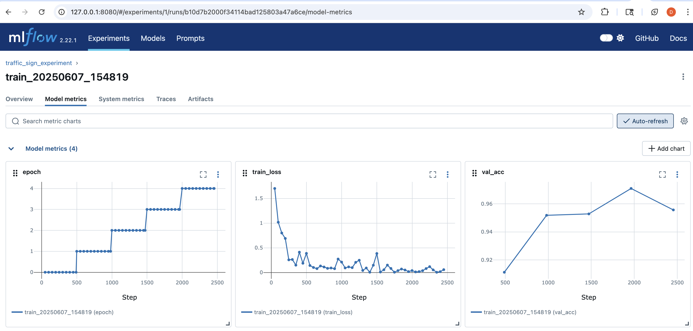

# Распознавания дорожных знаков. MLOps

Этот проект реализует MLOps-пайплайн для классификации дорожных знаков на датасете GTSRB (German Traffic Sign Recognition Benchmark) с использованием PyTorch Lightning и DVC. Включает версионирование данных, предобработку, обучение, экспорт в ONNX и инференс.

Данные и задачу можно посмотреть тут: [GTSRB](https://www.kaggle.com/datasets/meowmeowmeowmeowmeow/gtsrb-german-traffic-sign/data)    

---

## Структура проекта

```bash
Traffic-Sign-Recognition/
├── configs/                       # Конфигурации
│   ├── train/train.yaml           # Параметры обучения
│   └── infer/infer.yaml           # Параметры инференса
├── data/                          # Данные под управлением DVC
│   ├── raw/GTSRB/Train            # Исходные обучающие изображения
│   └── raw/GTSRB/Test             # Исходные тестовые изображения
│   └── splits/                    # Сплиты train/val/test
├── models/                        # Сохранённые модели
│   ├── checkpoints/               # Lightning чекпоинты
│   └── onnx/                      # ONNX-модель
├── scripts/                       # Скрипты пайплайна
│   ├── dvc_utils.py               # Загрузчик данных (DVC + KaggleHub)
│   ├── preprocess.py              # Разбиение на train/val/test
│   ├── train.py                   # Скрипт обучения (Lightning + MLflow)
│   ├── export_to_onnx.py          # Экспорт чекпоинта в ONNX
│   └── infer.py                   # Скрипт инференса
├── dvc.yaml                       # Описание DVC
├── dvc.lock                       # Замороженные хэши данных
├── pyproject.toml                 # Конфигурация Poetry и зависимости
└── README.md                      # Документация 
```

---

## Требования

* Python 3.9+ (до 3.11)
* [Poetry](https://python-poetry.org/) для управления зависимостями и окружением
* [DVC](https://dvc.org/) v2 для версионирования данных
* Учётная запись Kaggle для скачивания GTSRB

---

## Установка и настройка

### 1. Клонирование репозитория

```bash
git clone https://github.com/idknoo/Traffic-Sign-Recognition.git
cd Traffic-Sign-Recognition
```

### 2. Установка зависимостей

```bash
poetry install
poetry env activate
```

### 3. Настройка доступа к KaggleHub

Необходимо экспортировать переменные окружения с логином и ключом:

```bash
export KAGGLEHUB_USERNAME=<ваш_kagglehub_username>
export KAGGLEHUB_KEY=<ваш_kagglehub_key>
```

### 4. Инициализация DVC (один раз)

```bash
dvc init
mkdir dvc_remote
dvc remote add -d local dvc_remote
```

---

## Запуск пайплайна

### 1. Скачивание и версионирование данных

```bash
dvc repro download_data
dvc push
```

### 2. Предобработка — разбиение на train/val/test

```bash
poetry run python scripts/preprocess.py
```

### 3. Запуск MLflow-сервера 

В отдельном терминале:

```bash
poetry run mlflow server \
  --backend-store-uri sqlite:///mlflow.db \
  --default-artifact-root ./mlruns \
  --host 127.0.0.1 --port 8080
```

Открываем в браузере: [http://127.0.0.1:8080](http://127.0.0.1:8080)

### 4. Обучение модели

```bash
poetry run python scripts/train.py
```

* Использует PyTorch Lightning и логирование в MLflow
* Чекпоинт сохраняется в `models/checkpoints/final_model.ckpt`

Должны получить что-то типо такого (для быстрого обучения количество эпох понижено до 5): 
  


### 5. Экспорт модели в ONNX

```bash
poetry run python scripts/export_to_onnx.py
```

* Результат: `models/onnx/traffic_sign.onnx`

### 6. Инференс

По умолчанию скрипт смотрит в `data/raw/GTSRB/Test`. Чтобы запустить инференс:

```bash
poetry run python scripts/infer.py
```

Или указать другую папку с изображениями:

```bash
poetry run python scripts/infer.py images_dir=data/raw/GTSRB/Test
```

Результаты будут сохранены в `data/predictions.csv` со столбцами `filename,predicted_class`.

---

## Настройки

* **configs/train/train.yaml** — гиперпараметры, пути к данным, параметры обучения
* **configs/infer/infer.yaml** — путь к чекпоинту (`ckpt_path`), папка с изображениями (`images_dir`), выходной CSV

---

## Дополнительно

* Для очистки и повторного скачивания сырых данных:

  ```bash
  rm -rf data/raw/GTSRB && dvc repro download_data
  ```

---

